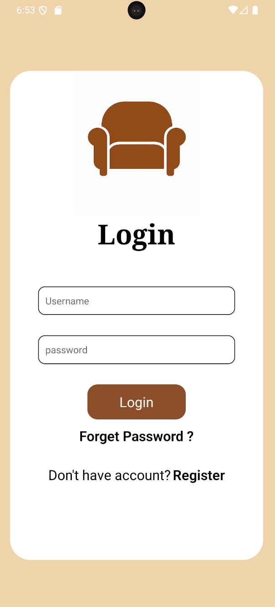
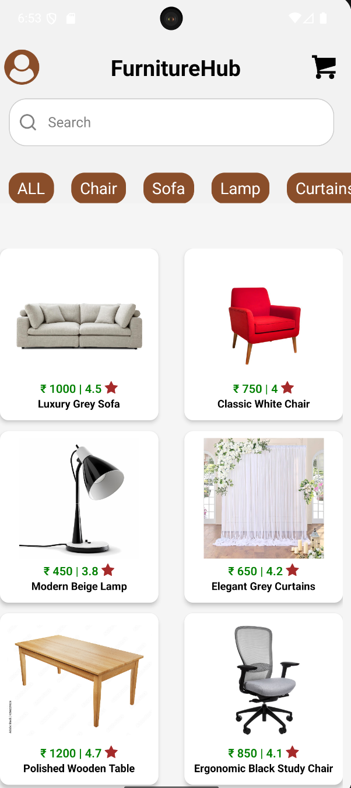
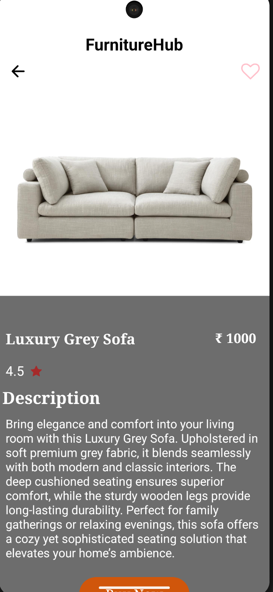
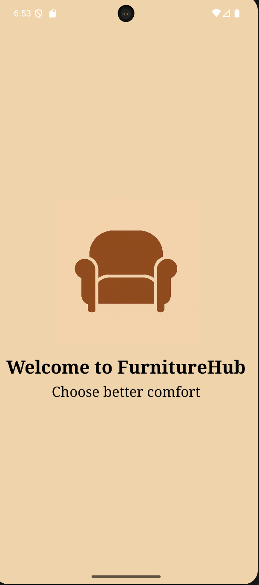

# 🪑 Furniture App

A simple mobile app built with **React Native** that demonstrates the basics of a furniture shopping application.  
This project currently includes a **Login page**, **Home page**, and **Product Information page**.

---

## ⚡ Features
- 📱 **Login & Register Screen**
- 🏠 **Home Page with product list**
- 🪑 **Furniture product details**

---

# 📸 Screenshots
<p align="center">
  
  
  
  
</p>


---

# 🛠️ Tech Stack
- React Native  
- JavaScript  
- [Android  Emulator]
---

## 🚀 How to Run Locally

### 1. Clone the repository
```bash
git clone https://github.com/Prashanty10/Furniture-app.git
### 2. Navigate to the project folder
cd Furniture-app/MyNewApp
3.npm install
4.npm start
5.npm run android


